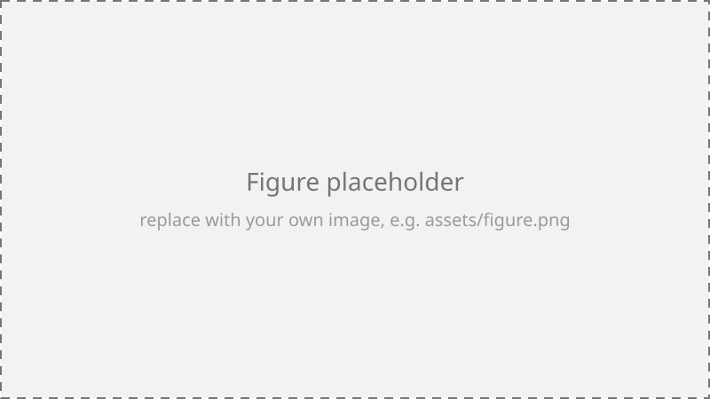

---
# iHuman Lab poster template — see README.md for full instructions.
#
# Built on the community quarto-ext/typst-templates "poster" extension
# (https://github.com/quarto-ext/typst-templates/tree/main/poster), which
# wraps Parth Parikh's typst-poster package. The package is vendored under
# _extensions/poster/ and lightly patched for lab branding (Rubik font,
# orange section rules/title) — see the comments in that file for details.
#
# Quick start:
#   1. Copy this whole `poster/` folder and rename it for your poster.
#   2. Edit the fields below (title, poster-authors, departments, size).
#   3. Replace assets/logo.png if you want different art.
#   4. Replace the placeholder text below with your own — keep roughly this
#      much content per section, or the poster will look sparse. Typst lays
#      columns out sequentially (fills column 1 top-to-bottom before starting
#      column 2), not balanced, so a short poster leaves the later columns
#      empty rather than spreading evenly.
#   5. Render with:  quarto render template.qmd
#      (Quarto bundles Typst itself, so no separate LaTeX/Typst install is needed.)
title: "Your Poster Title Goes Here"
# Referenced with a leading "/" (project-root-relative) because the image is
# loaded from inside the vendored Typst package, where a plain relative path
# would resolve against the package's own folder instead of this document's.
resources:
  - assets/logo.png
format:
  poster-typst:
    size: "36x24"
    poster-authors: "Your Name, Coauthor Name"
    departments: "Oklahoma State University"
    institution-logo: "/assets/logo.png"
    univ-logo-scale: "30"
    univ-logo-column-size: "5"
    # Left slot of the header, mirroring institution-logo on the right —
    # empty by default. To add a conference/venue logo, add its file under
    # assets/, list it under resources: above, and uncomment:
    # venue-logo: "/assets/venue-logo.png"
    # venue-logo-scale: "30"
    body-font-size: "24"
    footer-text: "Conference or Symposium Name · 2026"
    footer-url: "https://ihuman.okstate.edu"
    footer-emails: "your.email@okstate.edu"
    footer-color: "EC672C"
---

# Introduction

Motivate the problem in a full paragraph: what gap exists in prior work, why it matters to the field or to practice, and what this poster contributes. Aim for four to six sentences here — a poster read from a few feet away needs enough text to look substantial, but every sentence should still earn its place. Name the specific problem, not just the general area, so a passerby can tell in five seconds whether this poster is relevant to them.

- **Problem:** State the specific problem or question this work addresses.
- **Gap:** Explain concretely why existing approaches fall short — a missing capability, an untested assumption, a scale or population prior work didn't cover.
- **Contribution:** State what this poster presents, in one sentence a reader could repeat back to you.

## Objectives

- Objective one, stated as an outcome (not a task) — what will be true once this work succeeds.
- Objective two, distinct from objective one, not just a rephrasing of it.
- Objective three, if there is a natural third; don't pad the list if there isn't.

## Related Work

Briefly place this work relative to two or three closely related efforts. A sentence per citation is usually enough on a poster — save the detailed comparison for the paper. Note where this work extends, departs from, or combines prior approaches, and be specific about what's actually new here versus what's inherited.

# Methods

Describe your approach, system, or experimental setup in enough detail that a reader familiar with the area could roughly reproduce it. Favor short, concrete sentences over dense methodological prose — a poster is read standing up, often mid-conversation, so it needs to reward a thirty-second skim as well as a five-minute deep read.

1. Step or stage one — what happens first, and on what input.
1. Step or stage two — how the output of step one is transformed or used.
1. Step or stage three — what the final output of the pipeline is.

{width="60%"}

## Data & Setup

Describe the dataset, participants, materials, or experimental conditions: size, source, key preprocessing steps, and anything a reader would need to judge whether the results generalize. If there's a limitation baked into the setup (a small sample, a synthetic benchmark, a single population), it's better to name it here than to let a reader discover it in the results.

# Results

A table and/or a figure with your key findings — keep this to the one or two results you most want remembered, not everything you ran.

| Condition | Metric A | Metric B |
|---|---|---|
| Baseline | 0.62 | 0.71 |
| Ablation (no X) | 0.74 | 0.79 |
| **Proposed** | **0.81** | **0.88** |

: Headline result — replace with your own metric names and numbers. {#tbl-results}

@tbl-results shows the proposed approach outperforming both the baseline and an ablation that removes a key component, suggesting the improvement isn't just from the extra complexity. Summarize the practical size of the effect in plain language — "roughly a quarter fewer errors" reads faster than a raw percentage at poster-viewing distance. Bold the single number or phrase you most want a passerby to remember.

{width="60%"}

# Discussion

- What the result means in plain language, for someone who hasn't read the Methods section closely.
- One limitation or caveat, stated honestly rather than buried — reviewers and passersby both notice when it's missing.
- One implication for the field or for practice: who should do something differently because of this result, and what.

# Conclusion

::: {.block fill="rgb(221,221,221)" inset="14pt" radius="6pt" stroke="2pt + rgb(236,103,44)"}
**One-sentence takeaway** — the single claim you want someone to remember after a thirty-second glance at this poster, written so it stands on its own without the rest of the poster for context.
:::

- Supporting point one, tying back to a specific result above.
- Supporting point two.
- Future work: the next concrete step, not just "more research is needed."

## References & Acknowledgments

1. Author, A. (Year). *Title of paper*. Venue.
1. Author, B. & Author, C. (Year). *Title of paper*. Venue.
1. Author, D., Author, E., & Author, F. (Year). *Title of paper*. Venue.

This work was supported by [funding source]. Thanks to [collaborators/lab] for [specific contribution].
